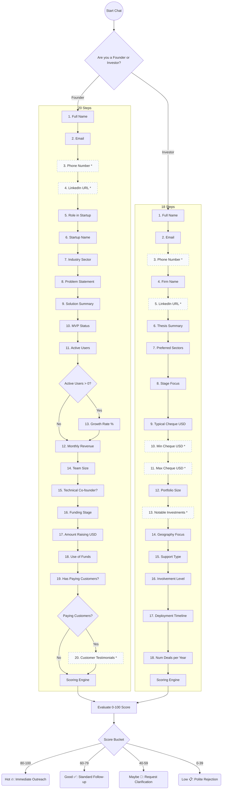

# LeadLens Conversation Flow

This document outlines the conditional paths and steps taken by the Venturizer Lead Qualification Chatbot. The chatbot utilizes two distinct persona flows (Founder and Investor) that capture different datasets and apply dynamic skip logic based on previous answers.

## Flow Diagram

> Note: Nodes marked with `*` and dashed borders represent optional questions.

### Skip Logic Details
The chatbot engine implements smart skipping to reduce user friction:
- **Growth Rate (Founder step 13)**: If a founder reports `0` active users, the chatbot automatically skips asking for user growth rate, knowing it is inapplicable.
- **Customer Testimonials (Founder step 20)**: If a founder indicates they do not have paying customers, the chatbot does not request customer testimonials and proceeds directly to scoring.
